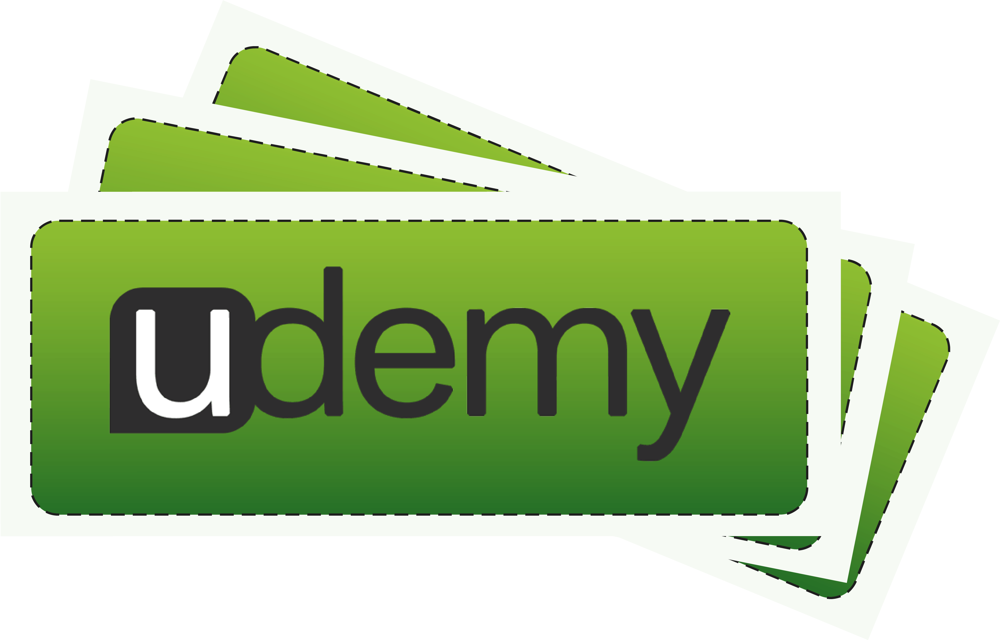

<h1>Python Complete Course Projects(2023)</h1>

<h2>This repository contains all the projects I did after I completed my Python Complete Beginner to Expert Course, a udemy paid course</h2>

Click this logo to verify the course

<h2>The Projects</h2>
1. Email Slicer 
2. Text to Speech Converter 
3. The 8 Balls Magic Game 
4. Tic-Tac-Toe Game 
5. Dice Rolling Game 
6. Hangman Game 
7. Rock Paper Scissors Game 

<h2>Email Slicer</h2> 

Email Slicer is a simple tool where the email address is provided as an input and as an output, the application returns the username and the domain of the email address given. It makes use of the slicing operations of Python.

<h2>Text to Speech Converter</h2>

<h2>The 8 Balls Magic Game</h2>
  
<h2>Tic-Tac-Toe Game</h2>

<h2>Dice Rolling Game</h2>
  
<h2>Hangman Game</h2>

<h2>Rock Paper Scissors Game</h2>
